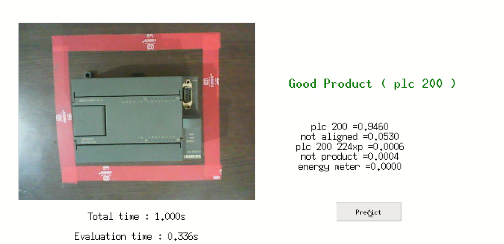
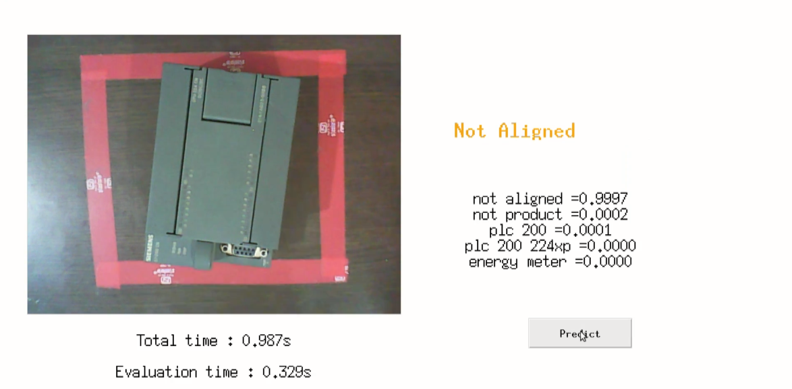
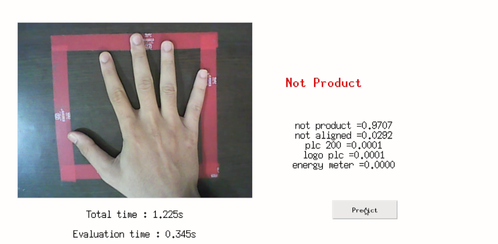

# Tkinter-Real-Time-Classifier
This is a tkinter based GUI for tensorflow classifier to classify various products in real time

### You need to have these files before executing the file-
  1. model_file (By default at "tf_files/retrained_graph.pb") And
  2. label_file (By default at "tf_files/retrained_labels.txt")

### Other Dependencies 
  1. Python
  2. Tensorflow (CPU or GPU)
  3. OpenCV (cv2)
  4. Tkinter 
  5. PIL
  
Once you have fulfilled the above requirements, go ahead and execute the `gui_for_classifier.py` file
You will see the live video feed from your webcam in the frame on left side
You need to click *predict* button to make a prediction
Results will be shown on the right hand side. Green if the label is other than *not product* which means a false product. 
Red if object or product is a false product and orange for *not aligned*

### Sample screens based on my tensorflow classifier

Youtube based video demonstartion will be comming soon

